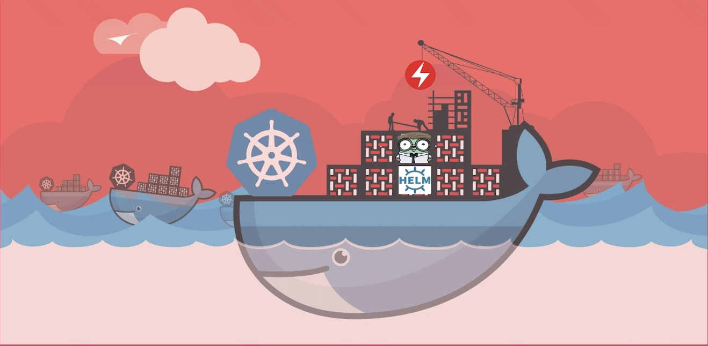

Book: Mastering Kubernetes Automation
==========
## A one-stop solution to become a Master in automating Kubernetes Deployments using Helm, Kubernetes Client Libraries, and Kubernetes Operators

Buy Now: <a target="_blank" href="https://www.amazon.in/gp/product/B09H7MTG24/ref=as_li_tl?ie=UTF8&camp=3638&creative=24630&creativeASIN=B09H7MTG24&linkCode=as2&tag=book53-21&linkId=9c87ebdc9fbf0e3367acb3a40b8ea4c9">Mastering Kubernetes Automation: Automate deployments using Helm , Kubernetes Operators and Kubernetes client libraries</a>

***Key Features***
<ul>
<li>Introduction to Kubernetes Resources and concepts</li>
<li>Introduction to Helm</li>
<li>Package Microservices using Helm</li>
<li>Automate deployments of Microservices using Helm</li>
<li>Introduction to Kubernetes Operators</li>
<li>Package Microservices using Kubernetes Operators</li>
<li>Automate deployments of Microservices using Kubernetes Operators</li>
<li>Create a Custom Resource and Custom Resource Definition</li>
<li>Create Custom Controller that behaves like a Kubernetes God</li>
<li>Introduction to Kubernetes Client Libraries</li>
<li>Package Microservices using Golang Client library</li>
<li>Automate deployments of Microservices using Golang Client library</li>
<li>Package Microservices using the javascript Client library</li>
<li>Automate deployments of Microservices using the javascript Client library</li>
</ul>

***Table of Contents***
<ol>
<li>Chapter1: Introduction to the Kubernetes Container Orchestration Platform</li>
<li>Chapter2: Install Prerequisites and Useful Resources</li>
<li>Chapter3: Kubernetes in Action</li>
<li>Chapter4: Introduction to the Helm package manager</li>
<li>Chapter5: Automate Application deployment using Helm</li>
<li>Chapter6: Introduction to the Kubernetes Golang and javascript Client Libraries</li>
<li>Chapter7: Automate Application deployment using Kubernetes Client Libraries</li>
<li>Chapter8: Introduction to the Kubernetes Operator Framework</li>
<li>Chapter9: Voting Application using Kubernetes Operator Framework</li>
<li>Chapter10: Deep dive into Rook Kubernetes Operator</li>
</ol>

***Who this Book is For***

This Book benefits the Kubernetes Community, especially Software and DevOps Engineers who are ready to take up Kubernetes Automation tasks in the near future. This book provides a comprehensive view of multiple ways to automate the Kubernetes deployments using Helm, Kubernetes Operators, and Client libraries such as Golang and JavaScript.

***Book Description***

Mastering Kubernetes Automation is the desired topic for all DevOps Engineers around the world. Kubernetes is an open-source matured container orchestrator platform designed by Google and now it is maintained by Cloud Native Computing Foundation. Kubernetes is meant for Automation. This book is for readers who are looking for Kubernetes automation offerings which include techniques, examples, and comprehensive guides. After reading this book, the end-user should be able to build end-to-end automation projects with growing complexity and functionalities. This book will be a one-stop solution for all Software Engineers including DevOps, who would like to automate the Kubernetes manifest deployments and understand Kubernetes concepts in-depth in an easy manner. Topics include a detailed description and explanation of the Kubernetes Resources, Kubernetes concepts, Kubernetes endpoints, policies, CIS benchmark recommendations, Installation Guide of prerequisites, and some useful resources. Some practical examples that give away knowledge on how to deploy applications to the Kubernetes cluster for beginners. Introduction to the Helm and detailed explanation of packaging one microservice architecture-oriented application using Helm and automate the deployments using Helm. Introduction to the Kubernetes operators and detailed explanation of writing a Custom Controller, Custom Resource, and Custom Resource Definition with one microservice architecture-oriented application. Introduction to the Kubernetes JavaScript and Golang client libraries, and detailed explanation of automating the deployments of a microservice architecture-oriented application using JavaScript and Golang client libraries.
